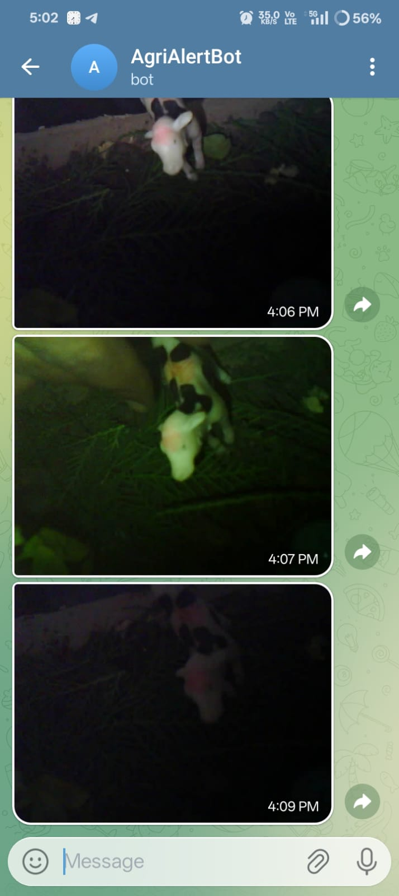
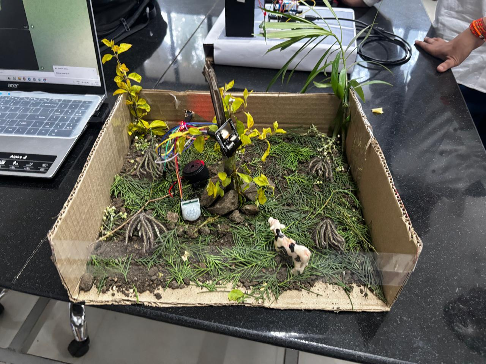
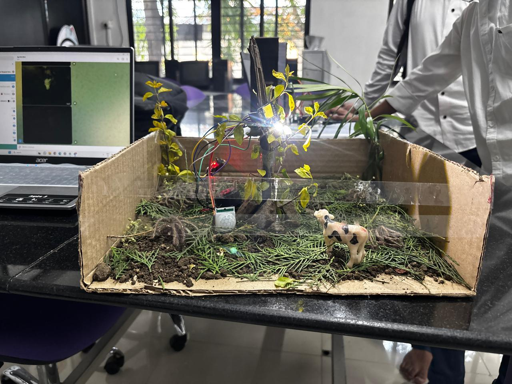

# 🐾 Wild Animal Monitoring & Alert System using ESP32-CAM

## 📌 Project Overview

The **Wild Animal Monitoring & Alert System** is an IoT-based embedded solution developed to detect wild animal intrusion in farm areas and provide instant real-time alerts to farmers.
When an animal enters the detection range of the PIR sensor, the system automatically captures an image using **ESP32-CAM** and sends it to a Telegram bot while simultaneously triggering a local buzzer alert.
This system aims to minimize crop damage and reduce human-animal conflict in rural and forest-border regions.

## ⚙️ Working Principle

- The **PIR motion sensor** detects movement when a wild animal enters the monitoring range.
- A **HIGH signal** is sent to the ESP32-CAM.
- The ESP32-CAM:
  - Activates a buzzer for immediate local alert.
  - Captures an image using the onboard camera module.
  - Sends the captured image instantly to a predefined Telegram Bot via WiFi.
- The farmer receives:
  - 📷 Real-time image evidence
  - 📩 Instant Telegram notification

This ensures rapid monitoring and timely response.

## 🛠 Hardware Components

- ESP32-CAM (AI Thinker)
- PIR Motion Sensor
- Buzzer
- WiFi Network
- Power Supply

## 💻 Technologies Used

- Arduino IDE
- Embedded C
- ESP32 Camera Library
- WiFiClientSecure
- Universal Telegram Bot Library
- Telegram Bot API

## 🚀 Key Features

- Real-time motion detection
- Automatic image capture
- Instant Telegram alert with photo
- Local buzzer alarm system
- Cost-effective and scalable design
- Suitable for farm and forest-border protection

## 🎯 Applications

- Agricultural farm security
- Forest border monitoring
- Rural intrusion detection system
- Human-animal conflict prevention

## 🔮 Future Enhancements

- AI-based animal classification (Edge ML)
- Solar-powered autonomous system
- Cloud storage integration
- GSM-based backup alert system
## 📸 Project Demonstration

### 📷 Telegram Bot Alert

### 🔧 Hardware Setup – View 1

### 🔧 Hardware Setup – View 2

## 👨‍💻 Developed By

**Shaikh Suleman Daud**  
**Santosh S. Puri**  
Electronics & Telecommunication Engineering
